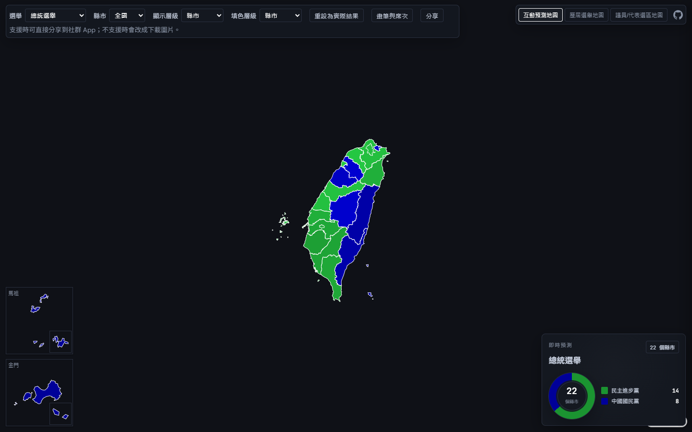

# tw-election-map

台灣選舉互動地圖，以純 HTML/CSS/JavaScript 實作，使用 Alpine.js 管理 UI 狀態、MapLibre GL JS 顯示地理資料。所有選舉與行政區資料皆預先匯出為靜態檔案，由瀏覽器直接載入，不依賴後端 API，也不需要前端 build step。

**Demo**：https://henry4682.github.io/tw-election-map/



## Features

- **互動預測地圖**：點選縣市／行政區，在實際得票結果跟自訂猜測之間切換候選人，或直接指定政黨塗色；可下載或分享合成好的結果圖片（含圖例、選舉名稱、是否修改過預測的標示）。
- **歷屆選舉地圖**：從縣市一路鑽層到村里，瀏覽歷屆總統、立委、縣市長等選舉在各層級的實際得票與贏家分布。
- **議員/代表選區地圖**：依選區檢視各政黨當選席次分布與候選人得票明細。
- 金門/馬祖等離島以獨立小地圖（inset）呈現，不會被主地圖的座標範圍稀釋掉。
- 純鍵盤可操作的行政區清單、可收合的窄螢幕版面，支援桌面與行動裝置。

## Architecture

```
CEC（中選會）/ 內政部國土測繪中心 開放資料
              │
              ▼
   私有 Laravel/Filament 後端（ETL + 行政區界編輯）
              │
              │  election:export-* 指令
              ▼
      靜態 GeoJSON / JSON 資料檔案
              │
              ▼
   tw-election-map（這個 repo：HTML + Alpine.js + MapLibre GL JS）
              │
              ├── GitHub Pages
              └── Cloudflare Workers Static Assets
```

前端不會直接呼叫中選會或任何即時 API，也不由後端 serve 動態內容——所有資料在後端整理好之後匯出成靜態檔案，這個 repo 純粹是「靜態檔案 + 瀏覽器端渲染」，跟後端完全解耦。

此 repository 為公開部署用的靜態前端版本。資料整理、行政區界處理與匯出由另一個 Laravel/Filament 後端專案負責（維持私有，內部行政區界編輯/ETL 管理工具），本 repository 僅包含可公開部署的前端程式與匯出資料。

## 目錄結構

- `index.html`：入口頁面
- `js/app.js`：Alpine 元件（地圖初始化、互動邏輯）
- `css/style.css`：手寫 CSS，沒有用框架
- `data/`：靜態資料檔案（GeoJSON 邊界 + 候選人/得票資料），由後端 `election:export-*` 系列指令產生
- `test/`：`node:test` 單元測試 + Playwright e2e smoke test（見下方「測試」）

## 本機執行

沒有 build 步驟，直接用任一個簡單的本機 HTTP server 開（用 `file://` 直接開瀏覽器可能會因為 CORS 擋掉 `fetch()` 讀 `data/` 底下的檔案，一律用 http-server 開）：

```bash
npx http-server
```

## 測試

`js/app.js` 裡不摸 DOM/MapLibre 的純函式（tooltip 格式化、投影座標換算、資料轉換等）用 Node 內建的 `node:test` 測試，沒有另外裝 Jest/Vitest 這類套件——跟這個前端「沒有 build 工具」的原則一致，`test/` 底下的測試檔可以直接 `require('../js/app.js')`（檔案末尾的 `module.exports` 只在 Node 環境生效，瀏覽器裡的 `<script>` 標籤載入方式不受影響）。

```bash
node --test "test/*.test.js"
```

建議明確指定 `test/*.test.js`，避免只給資料夾路徑（`node --test test/`）或完全不給參數（`node --test`）時，不同 Node 版本的預設遞迴探索行為掃到無關檔案。

會建立 DOM 元素或操作 MapLibre 實例的函式、Alpine 元件本身的響應式綁定不在這裡測，那些需要真的瀏覽器環境，用 `test/e2e/` 底下的 Playwright smoke test：

```bash
cd test/e2e
npm install
npx playwright install chromium   # 第一次執行需要先安裝瀏覽器執行檔
npm test
```

## 部署

**GitHub Pages**（這個 repo）：直接從 `main` branch 根目錄部署（Settings → Pages → Source: Deploy from a branch → `main` / `/root`），沒有額外的 build/發布腳本——repo 本身就是可以直接服務的靜態內容，`data/` 底下是真的資料檔案（不是用 `.gitignore` 排除）。

`data/` 約 600MB，主要由村里層級 GeoJSON 與歷屆選舉資料構成。由於資料更新頻率低，目前直接納入 repository 並隨 GitHub Pages 部署；若未來更新頻率提高，再考慮改為外部儲存或自動化發布流程。

主專案另外也部署於 Cloudflare Workers Static Assets：
https://tw-election-map.henry194557.workers.dev/

GitHub Pages 與 Cloudflare Workers 兩個部署版本目前並存，並各自獨立更新。

## 資料更新

資料由後端的 `election:export-*` 系列指令產生，這裡只是同步過來的靜態拷貝：

1. 在後端專案跑完想發布的 `election:export-*` 指令，確認匯出的 `frontend/data/` 內容正確。
2. 把前端程式碼 + `data/*.json` 整份同步過來這個 repo，commit、push。

目前是手動同步（複製檔案+commit），還沒有自動化腳本。

## 資料來源與授權

地圖上顯示的資料本身不是本專案原創產出，來源如下：

- **選舉開票資料**：[中央選舉委員會（CEC）選舉資料庫](https://data.cec.gov.tw/) 公開的歷屆選舉原始資料（`votedata.zip`），屬政府公開資料，依中選會網站公告的開放資料授權條款使用；本專案僅做資料整理、彙總與視覺化呈現，未變更原始得票數字。
- **行政區界圖資（GeoJSON）**：主要來源為內政部國土測繪中心村里界圖，經 [dkaoster/taiwan-atlas](https://github.com/dkaoster/taiwan-atlas) 專案轉製後取用；使用條款請參照該專案本身標示的授權。
- **部分村里界線補值**：taiwan-atlas 沒有涵蓋到的少數村里，改用內政部「社會經濟資料服務平台」（[SEGIS](https://segis.moi.gov.tw/)）發布的歷史村里界圖資快照補齊，同屬政府公開資料。

如對資料授權範圍或引用方式有疑慮，請以中選會、內政部國土測繪中心及 taiwan-atlas 專案各自公告的條款為準；本說明僅供快速理解來源，不構成法律意見。

## License / Acknowledgements

程式碼採用 [MIT License](LICENSE)。

- 前端架構設計參考 [jacksonjude/USA-Election-Map](https://github.com/jacksonjude/USA-Election-Map)——同樣是純靜態頁面、資料預先匯出成檔案、瀏覽器端解析、不依賴後端 API 的設計。
- 資料整理過程中曾參考第三方資料集 [MISNUK/CECDataSet](https://github.com/MISNUK/CECDataSet) 交叉核對部分歷史選舉的資料格式與完整性；實際使用的資料仍以中選會官方發布為準。
